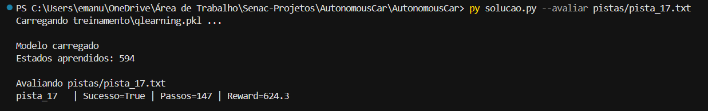
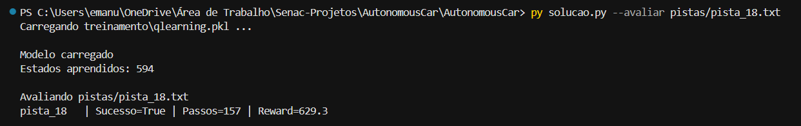

# Q-Learning | Carro Autônomo

---

## 1. Visão geral
  Este projeto implementa um agente de Q-Learning tabular para controlar um carro autônomo em uma pista 2D baseada em grid e tem como principal objetivo aprender, por interação com o ambiente, uma política para conduzir da largada até a chegada evitando colisões.

  Abordagem (RL):
  - Estado contínuo: vetor LIDAR de 6 dimensões
  - Discretização para tabela Q
  - Política ε-greedy
  - Treinamento em round-robin em múltiplas pistas
  - Avaliação em pistas de holdout (17 e 18)

---

## 2. Estrutura de solucao.py

  1. Configuração geral e paths
  2. Implementação do agente (Q-Learning)
  3. Loop de treinamento (round-robin)
  4. Avaliação e geração de relatórios
  5. Serialização do modelo (pickle)
  6. Função main()

---

## 3. Ambiente
  O ambiente consiste em uma pista bidimensional representada por um grid contendo células de asfalto, paredes, posição inicial e linha de chegada. O carro possui posição contínua, velocidade e orientação angular.

  A cada passo de tempo, o agente pode executar uma entre cinco ações possíveis: manter o estado atual, acelerar, frear, virar à esquerda ou virar à direita.

  A observação recebida pelo agente é composta exclusivamente pelas leituras dos sensores LIDAR e pela velocidade normalizada. Dessa forma, o agente não possui acesso à sua posição absoluta nem ao mapa da pista, devendo aprender a navegar apenas com base em informações locais.

---

## 4. Agente Q-Learning (AgenteQLearning)

### 4.1 Representação do estado
  Estado observado pelo agente: obs = [d_0, d_+30, d_-30, d_+60, d_-60, v_norm]
  
  Cada componente está em [0, 1].

- Discretização para Q-learning tabular:
  
  Definição da função:
    ```
    def discretizar(obs):
        return tuple(min(int(v * K), K - 1) for v in obs)
    ```
  Cada variável é dividida em K bins (default: K=3).
  Estado final: tupla de 6 inteiros.


### 4.2 Tabela Q

  - Estrutura da Q-table:
    ```
    self.Q = {
        estado_discreto: np.array([Q(a0), Q(a1), ..., Q(a4)])
    }
    ```
- Inicialização:
  - Estados criados sob demanda
  - Inicialização com valores pequenos aleatórios:
    `np.random.uniform(-0.01, 0.01, n_actions)`

  OBS: n_actions = 5 (assumindo 5 ações possíveis)

### 4.3 Política ε-greedy
- Algoritmo:
  - Se um valor aleatório < ε: ação aleatória
  - Caso contrário: ação = argmax Q(s)
- Propriedades:
  - ε começa alto (exploração)
  - ε decai ao longo do treinamento
  - Converge para exploração quase nula

### 4.4 Atualização Q-Learning
- Equação (atualização padrão):
  - Q(s, a) ← Q(s, a) + α [ r + γ max_{a'} Q(s', a') − Q(s, a) ]
- Casos:
  - Se o episódio termina: alvo = reward
  - Caso contrário: alvo = reward + γ max Q(s', a')
  
---

## 5. Treinamento (Round-Robin)
- Estratégia:
  - O agente treina alternando entre as 16 pistas de treino:
    - pista = random.choice(pistas_treino)
- Motivo:
  - Evita overfitting em uma única pista
  - Evita esquecimento catastrófico
  - Evita viés de sequência
- Estrutura do treinamento:
  - Cada episódio usa uma pista aleatória
  - Ambiente reutilizado via cache (envs)
  - Atualização ocorre a cada step
  - Decaimento de ε:
    - eps = linear_decay(eps_inicial → eps_final)
  - Exploração alta no início, exploração baixa no final

---

## 6. Função de recompensa
- Recompensa vem diretamente do ambiente:
  - Progresso na pista: positivo incremental
  - Penalidade por tempo: -0.1 por passo
  - Colisão: -100 (termina episódio)
  - Chegada: +500

---

## 7. Avaliação
- Configuração:
  - ep = 0.0 (política gulosa)
- Métricas coletadas:
  - número de passos
  - recompensa total
  - sucesso (chegou ao fim)
  - velocidade média
  - velocidade máxima

---

## 8. Serialização (Pickle)
- O modelo salvo contém:
  - {
      "q_table": agente.Q,
      "discretization_K": K,
      "n_episodes_trained": total,
      "rewards_history": ...,
      "config": {
          "alpha": α,
          "gamma": γ
      }
    }
- Arquivo gerado:
  - treinamento/qlearning.pkl

---

## 9. Função main()
- Fluxo geral:
  - Parse de argumentos CLI
  - Treinamento ou carregamento do modelo
  - Construção do agente de avaliação
  - Avaliação nas pistas: 17, 18
  - Geração de arquivos .txt

---

## 10. Resultados obtidos
  Durante o treinamento, o agente foi exposto às 16 pistas de treinamento utilizando a estratégia round-robin. Após o término do treinamento, o modelo foi avaliado nas pistas de holdout (17 e 18), que não participaram do processo de aprendizado.

  | Pista | Sucesso | Passos | Recompensa |
  |--------|----------|----------|------------|
  | 17 | Sim | 147 | 624.3 |
  | 18 | Sim | 157 | 629.3 |

  Os resultados demonstram que o agente conseguiu generalizar seu comportamento para pistas não vistas anteriormente. Mesmo utilizando uma representação simplificada baseada apenas em sensores LIDAR, o modelo foi capaz de concluir ambas as pistas de avaliação com sucesso.

---

## 11. Análise crítica do comportamento
- Pontos fortes:
  - Generalização razoável com estado reduzido (LIDAR)
  - Aprendizado eficiente com discretização K=3
  - Round-robin ajuda na estabilidade do aprendizado
- Limitações observadas:
  - Falhas em pistas específicas (10, 14, 16)
  - Sensível à geometria de curvas fechadas
  - Tabela Q ainda relativamente pequena (594 estados aprendidos)
- Interpretação do número de estados:
  - Estados aprendidos: 594
  - Espaço total possível: 5^6 = 15.625
  - visitado: ~3.8% do espaço

---

## 12. Conclusão
  A implementação do algoritmo Q-Learning tabular demonstrou ser capaz de resolver o problema de navegação proposto utilizando apenas informações locais fornecidas pelos sensores LIDAR. A discretização dos estados permitiu transformar observações contínuas em uma representação adequada para aprendizado tabular.

  Os resultados obtidos nas pistas de holdout indicam que o agente foi capaz de generalizar o conhecimento adquirido durante o treinamento para ambientes não vistos anteriormente. Além disso, a estratégia de treinamento round-robin contribuiu para aumentar a robustez da política aprendida e reduzir a especialização em pistas específicas.

  Como possíveis extensões futuras, podem ser exploradas abordagens baseadas em redes neurais, como Deep Q-Networks (DQN), além de técnicas de discretização mais refinadas para lidar com pistas de maior complexidade.


---

## 13. Visualização do Agente
  Foram realizadas execuções do agente treinado nas pistas de avaliação com o objetivo de observar visualmente o comportamento aprendido.

  As execuções mostraram que o agente conseguiu coordenar velocidade e direção de maneira consistente, reduzindo colisões e mantendo o progresso ao longo da pista até alcançar a linha de chegada.

  
  

  ---
  
